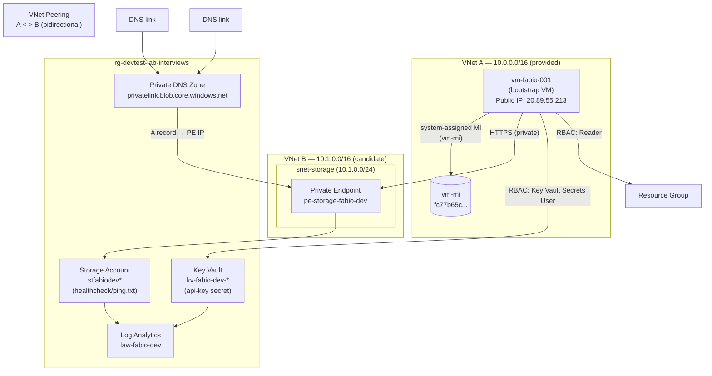

# Robots Inc. Azure Infrastructure Challenge

## Architecture



### Identity lanes

```
vm-mi (system-assigned)   ──► Reader on RG
                           ──► Key Vault Secrets User on app KV
                           ──► Storage Blob Data Reader on app SA

id-manager (user-assigned) ──► Contributor on RG  [provisioning only]
                           ──► Key Vault Secrets Officer on app KV [provisioning only, via access-manager]

access-manager (user-assigned) ──► RBAC Admin on RG [role assignment only]
```

---

## RBAC Matrix

| Identity | Resource | Role | Can read api-key | Can read ping.txt | Can list RG resources | Can write storage | Can create/delete resources | Can assign roles |
|---|---|---|---|---|---|---|---|---|
| `vm-mi` | App KV | Key Vault Secrets User | ✅ | — | — | ❌ | ❌ | ❌ |
| `vm-mi` | App SA | Storage Blob Data Reader | — | ✅ | — | ❌ | ❌ | ❌ |
| `vm-mi` | RG | Reader | — | — | ✅ | ❌ | ❌ | ❌ |
| `id-manager` | RG | Contributor | ❌ | ❌ | ✅ | ❌ | ✅ | ❌ |
| `id-manager` | App KV | Key Vault Secrets Officer | ✅ (write+read) | — | — | — | — | ❌ |
| `access-manager` | RG | RBAC Admin (constrained) | ❌ | ❌ | ❌ | ❌ | ❌ | ✅ (no Owner/Contributor) |

---

## Step-by-step Deploy

### Prerequisites (on the bootstrap VM)

```bash
# Install Terragrunt
TGVER=0.58.0
curl -sL "https://github.com/gruntwork-io/terragrunt/releases/download/v${TGVER}/terragrunt_linux_amd64" \
  -o /usr/local/bin/terragrunt && chmod +x /usr/local/bin/terragrunt

# Install Terraform
TFVER=1.8.5
curl -sL "https://releases.hashicorp.com/terraform/${TFVER}/terraform_${TFVER}_linux_amd64.zip" \
  -o /tmp/tf.zip && unzip /tmp/tf.zip -d /usr/local/bin/

# Install Go (for Terratest)
curl -sL https://go.dev/dl/go1.21.11.linux-amd64.tar.gz | sudo tar -C /usr/local -xz
export PATH=$PATH:/usr/local/go/bin

# Install Python test deps
pip3 install pytest requests
```

### 1. Fill in tag values

Edit the two placeholder values in every `terragrunt.hcl` leaf file:

```bash
find infra/live -name "terragrunt.hcl" | xargs sed -i \
  's/CostCenter   = "FILL_ME"/CostCenter   = "<your-value>"/g; \
   s/AssignmentId = "FILL_ME"/AssignmentId = "<your-value>"/g'
```

### 2. Login as id-manager for provisioning

```bash
az login --identity --client-id 297f855a-c1c3-4a2a-94c8-04e9b4557c62
```

### 3. Deploy infrastructure

```bash
make apply ENV=dev
```

This runs modules in dependency order: networking → storage → keyvault → observability → rbac.

### 4. Write .env and start the API

```bash
make env ENV=dev
make docker-up
```

### 5. Smoke test

```bash
curl http://localhost/health
# {"status":"ok"}

API_KEY=$(cd infra/live/dev/keyvault && terragrunt output -raw api_key_value)
curl -H "X-API-Key: $API_KEY" http://localhost/storage/ping
```

### 6. Enable HTTPS (when DNS is ready)

Edit `caddy/Caddyfile`: replace `:80` with your hostname, e.g.:

```
fabio.interviews.robots-inc.io {
    reverse_proxy api:8000
}
```

Then `make docker-up` — Caddy auto-provisions a Let's Encrypt cert.

---

## Step-by-step Destroy

Destroys only candidate-managed resources. Bootstrap VM, VNet A, admin KV, id-manager, and access-manager are **not touched**.

```bash
make destroy ENV=dev
```

Or manually in reverse order:

```bash
cd infra/live/dev
# Login as access-manager first (for RBAC deletions)
az login --identity --client-id 1c984177-182e-4d71-8fd0-99989661976e
cd rbac && terragrunt destroy -auto-approve && cd ..

# Switch to id-manager for resource deletions
az login --identity --client-id 297f855a-c1c3-4a2a-94c8-04e9b4557c62
cd observability && terragrunt destroy -auto-approve && cd ..
cd keyvault      && terragrunt destroy -auto-approve && cd ..
cd storage       && terragrunt destroy -auto-approve && cd ..
cd networking    && terragrunt destroy -auto-approve && cd ..

docker compose down
```

---

## Design Decisions

### NSG rules

The storage subnet NSG allows inbound HTTPS only from VNet A (`10.0.0.0/16`) — the CIDR that contains the bootstrap VM. Everything else inbound is denied at priority 4000. There is no `0.0.0.0/0` inbound allow rule. Outbound traffic is only permitted back to VNet A and within VNet B. This gives the tightest envelope that still allows the private endpoint to function correctly.

### Why runtime uses vm-mi while provisioning uses id-manager

Least privilege by lane. The running API only ever reads (secrets, blobs, resource listings) — it never needs to create or modify infrastructure. Giving it a Contributor identity would let a container escape become an infrastructure escape. id-manager is scoped to Contributor on the RG so Terraform can provision resources; it cannot assign roles, preventing privilege escalation. The two identities are never mixed.

### How the API authenticates to Key Vault and ARM without storing credentials

`ManagedIdentityCredential()` (no `client_id` argument) acquires an OAuth2 token from the Azure IMDS endpoint (`169.254.169.254`) using the VM's system-assigned identity. The token is short-lived and automatically refreshed by the SDK. No secrets, no service principal keys, no environment variables with credentials.

### Why the API secret lives in a candidate-owned Key Vault

The shared administrative KV (`dtlinterviews3004`) is interviewer-managed infrastructure. Storing the API key there would: (a) require granting vm-mi access to an interviewer resource, (b) make teardown leave traces in a vault we don't own, and (c) violate the principle of resource ownership boundaries.

### Metric alert choice

**Key Vault Availability < 100%** for 5 minutes. Justification: if the KV becomes unavailable, the API cannot fetch its `api-key` secret at startup. This causes total service failure with no visible error to callers (the container simply fails to start). The alert provides early warning before the KV issue becomes a deployment failure. Dev severity = Warning (2); prod severity = Error (1).

### Recurring cost resources

| Resource | Cost driver | Mitigation |
|---|---|---|
| Private Endpoint | ~$7/month per endpoint | One PE per env; removed in dev teardown |
| Log Analytics | Per-GB ingestion + retention | 30-day retention; 0.5 GB/day cap (dev), 1 GB/day (prod) |
| Storage Account | Capacity + transactions | LRS in dev; ZRS only in prod |
| Public IP | ~$3/month (standard static) | Interviewer-provided; not duplicated |

VNets, NSGs, managed identities, RBAC assignments, private DNS zones — no meaningful direct cost.

### id-manager Key Vault Secrets Officer assignment

Terraform (running as id-manager) needs to write the `api-key` secret to the application KV. With RBAC authorization enabled on the KV, Contributor on the RG does not grant data-plane secret write access. The assignment is created by access-manager (the only identity permitted to write role assignments), used only during `terraform apply`, and is documented in the RBAC matrix. It is **not** used by the running API; vm-mi has the narrower `Key Vault Secrets User` (read-only) for runtime.

---

## Known Issues / Things I'd Do With More Time

- **TLS**: Caddy is configured for HTTP; needs a real hostname delegated before Let's Encrypt can issue a cert. The Caddyfile change is one line.
- **Prod isolation**: Both environments share the same resource group (lab constraint). In production I'd use separate subscriptions per environment.
- **State backend bootstrapping**: The `stinterviewtfstate001` backend was pre-created by the interviewer. A full bootstrap script would create it using `az` CLI before the first `terragrunt init`.
- **Terratest**: Go test uses `DefaultAzureCredential` which picks up the VM's system-assigned identity at runtime. For CI, you'd pass a service principal via env vars.
- **Secret rotation**: The `api-key` is set once at `terraform apply`. A production setup would use Key Vault secret rotation with an Event Grid trigger.
- **`/resources` filter**: Currently filters by `Owner=fabio` tag. A more robust filter would use a dedicated `AssignmentId` tag value passed at deploy time.
